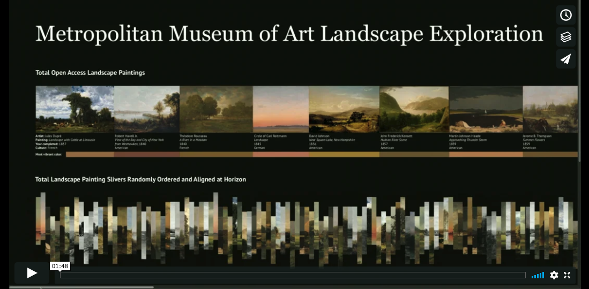
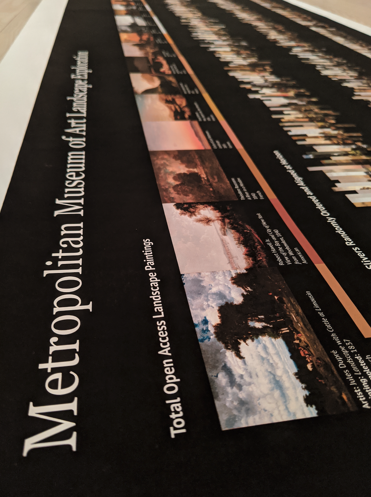

# Met New Contexts Project
## Landscape Exploration Poster
December 2019

This long format poster visualization continues to explore the Met's landscape painting through the 
slivers generated in the Landscape Generator project by showcasing all available pieces in grouped assortments.

## Video of final poster:

This poster is an in depth exploration of the dataset created within the [Landscape Generator](https://github.com/amandersonyou/MajorStudio1_AAY/blob/master/Met_Interactive/README.md).
All 30 of the Met's open access landscape paintings are shown in full with artist and artwork details. In addition, 
a color swatch of the most vibrant color from each painting generated using the vibrant.js library is included under 
each full artwork.

Below this is a full length visual of all 441 generated slivers randomly called side by side & vertically 
aligned at their assigned horizon. A unique shape comes into view with a steady "line" through the middle 
at the horizon. The viewer sees the shape of the negative space, but also the consistency of the horizon.
I also looked at the divide between American artists and European artists in this same fashion.

The final row in the poster groups the slivers by their assigned horizon value. The groupings are no longer 
jagged in height, and are instead smooth across with a very gradual decline in horizon line as your eye follows 
across the poster from left to right. The viewer can also see quantity in horizon line groupings, where horizon  
valuees closer to the midpoint are more frequent than the extreme lows or highs.

## Methodology:

For this poster, I utilized the painting slivers I created in the previous Landscape Generator project.
I then altered my P5.js code to output the various landscape images outlined above. I structured the poster 
in Adobe Illustrator and printed it on a large format plotter printer. 

In February 2020, the poster was featured at [Data Through Design](https://2020.datathroughdesign.com/), a gallery celebrating NYC Open Data.

