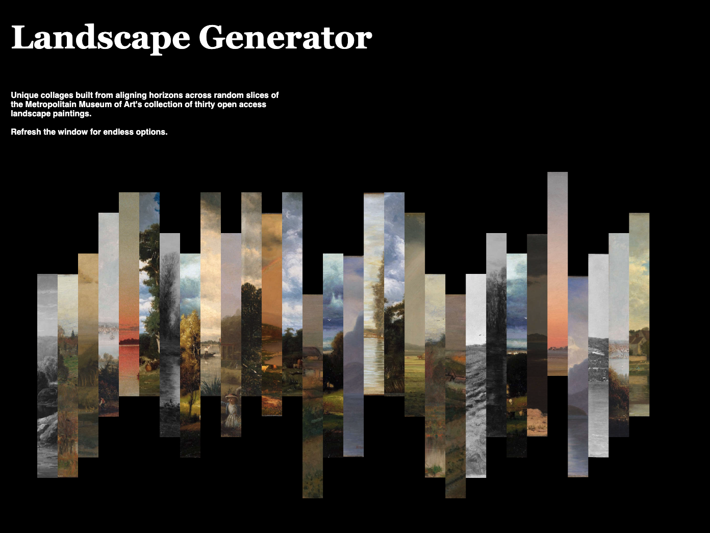
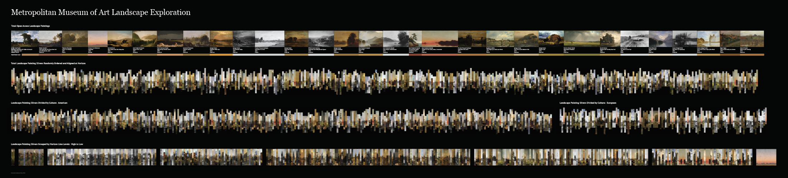
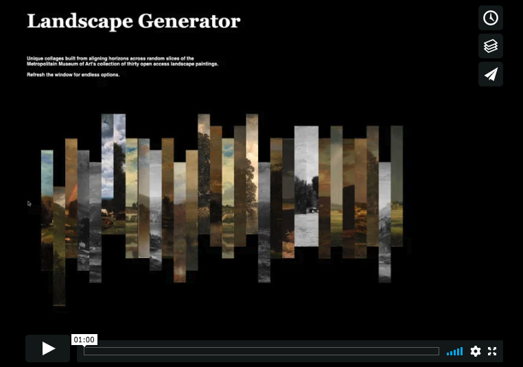
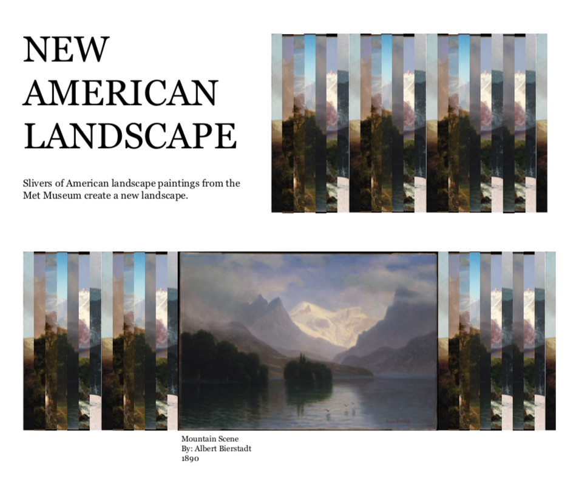
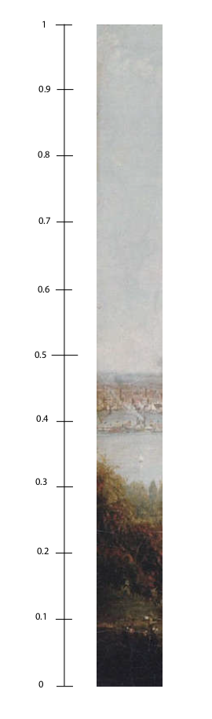
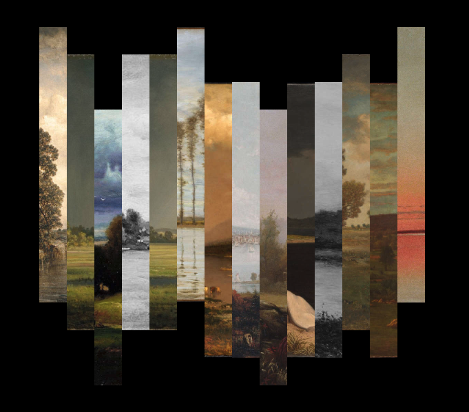
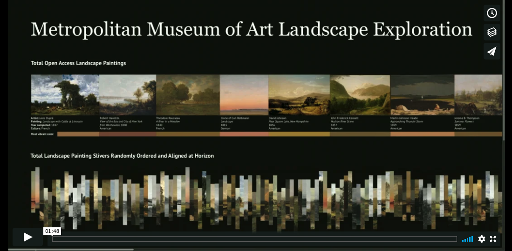
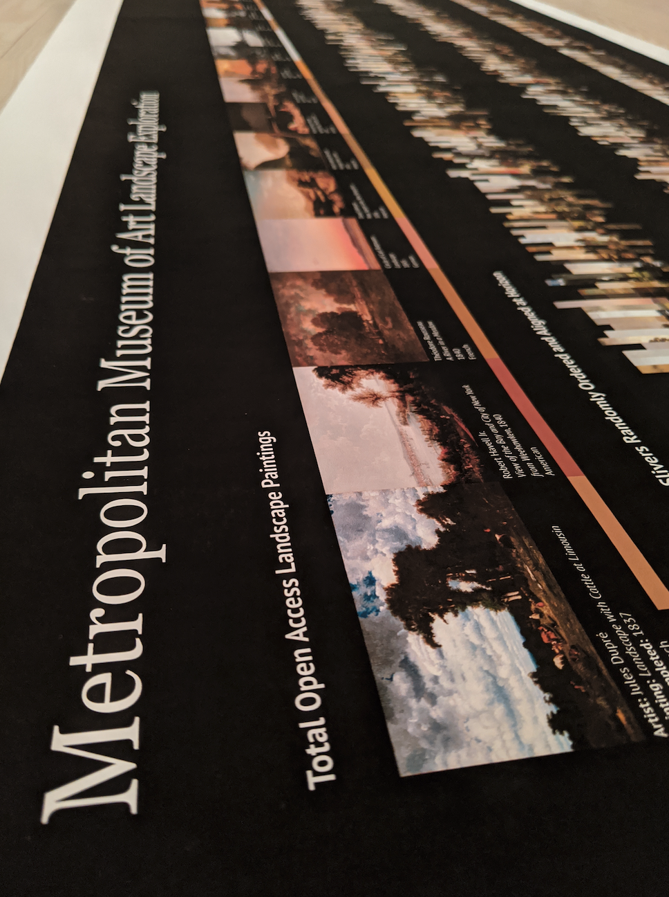
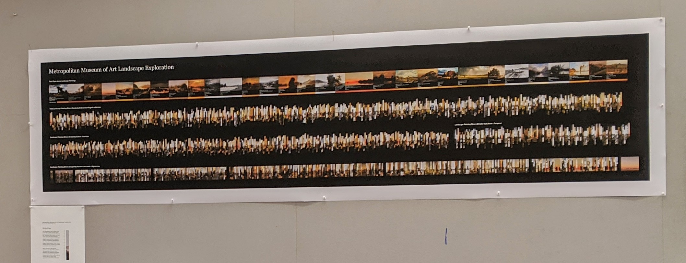

# Met Interactive Project
## Landscape Generator
November 2019





The Landscape Generator is an interactive website made to encourage the user to 
engage with landscape paintings from the Metropolitan Museum of Art's collection 
in a new and unusual way, leading them to discover details about the art they may 
overlook with a traditional view. As an evolution to the Landscape Generator, a 
large format poster visualization continues to explore the collection of generated 
slivers by showcasing all available pieces in various grouped assortments.

Visit and interact with the website:
https://amandersonyou.github.io/MajorStudio1_AAY/Met_Interactive/

## Video of website interaction:
[](https://vimeo.com/379168259 "Landscape Generator Video - Click to Watch!")


For the third project of Major Studio 1, I made a visualization that creates 
new landscapes out of slices of landscape paintings from the Met's collection. 
The slices are randomly ordered, and aligned at their horizon lines for a unique, 
collaged curation.

The goal of this visualization is to allow for artistic exploration and to encourage the 
viewer to see the landscape paintings in a new way. The slices bring your attention to 
small details that get lost in the full artwork, but stand out when juxtaposed next to 
other related, but different artworks. 


## Methodology:

My process begins with determining my dataset. I pulled images from the Met API that 
had the medium of painting, and the keyword of landscape. Of the hundreds of results, 
thirty paintings had open access downloadable art. I then adjusted the size of the images 
to have a consistent height, and used an image manipulation javascript library called 
jimp.js to create slices of each image at a consistent width. Once sliced, I ended up 
with 441 individual image files.

Original sketch: 


jimp.js code example:

```
var Jimp = require('jimp');

Jimp.read('landscapePaintings/459099_landscapeWithCattleatLimousin.jpg')
  .then(land => {
    return land
      .crop(1600, 0, 100, 1000)
      .quality(60) // set JPEG quality
      // .write('crops/16_459099_landscapeWithCattleatLimousin.jpg'); // save
  })
  .catch(err => {
    console.error(err);
  });
```

I created a comprehensive JSON file containing each image slice's link, the manually 
determined horizon level for each slice (valued between 0 and 1), the url link to the 
full painting on the Met website, and the painting's name.

```
    {
        "name": "The Village of La Celle-sous-Moret",
        "img_src":"https://raw.githubusercontent.com/amandersonyou/MajorStudio1_AAY/master/Met_Interactive/crops800/4_436849_theVillageofLaCellesousMoret.jpg",
        "horizon": 0.5,
        "met_url": "https://www.metmuseum.org/art/collection/search/436849"
    },
    {
        "name": "The Village of La Celle-sous-Moret",
        "img_src":"https://raw.githubusercontent.com/amandersonyou/MajorStudio1_AAY/master/Met_Interactive/crops800/5_436849_theVillageofLaCellesousMoret.jpg",
        "horizon": 0.6,
        "met_url": "https://www.metmuseum.org/art/collection/search/436849"
    },
```

Guide used when assigning horizon levels:



I used p5.js to write functions that loop through all of the json objects, selecting 14 
random slices to assemble into a new landscape. The y position of the slices is influenced 
by the horizon value to have each slice line up and create a relatively flat horizon 
across the image. Each time the page is refreshed, the generated landscape changes. 
By creating a "newData" array, I avoid duplicate slices within the same landscape, however 
I intentionally allow slices from the same painting to appear within the new image. 
Using mouse position, when the user clicks on each slice, they are taken to the Met 
website for that particular painting to see the full view and how the slice fits into the whole.




### New Contexts:

To take this project further and continue to use the data structured for the Landscape Generator, 
I decided to create a large scale poster exploring the landscape slivers.

## Video of final poster:
[](https://vimeo.com/379171213 "Landscape Exploration Poster Video - Click to Watch!")


All 30 of the Met's open access landscape paintings are shown in full with artist and artwork details. In addition, 
a color swatch of the most vibrant color from each painting generated using the vibrant.js library is included under 
each full artwork.

Below this is a full length visual of all 441 generated slivers randomly called side by side & vertically 
aligned at their assigned horizon. A unique shape comes into view with a steady "line" through the middle 
at the horizon. The viewer sees the shape of the negative space, but also the consistency of the horizon.
I also looked at the divide between American artists and European artists in this same fashion.

The final row in the poster groups the slivers by their assigned horizon value. The groupings are no longer 
jagged in height, and are instead smooth across with a very gradual decline in horizon line as your eye follows 
across the poster from left to right. The viewer can also see quantity in horizon line groupings, where horizon  
valuees closer to the midpoint are more frequent than the extreme lows or highs.




## Methodology:

For this poster, I utilized the painting slivers I created in the previous Landscape Generator project.
I then altered my P5.js code to output the various landscape images outlined above. I structured the poster 
in Adobe Illustrator and printed it on a large format plotter printer. 


