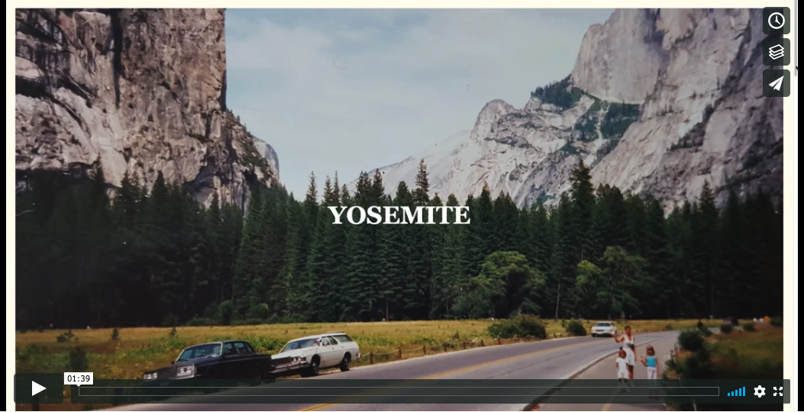
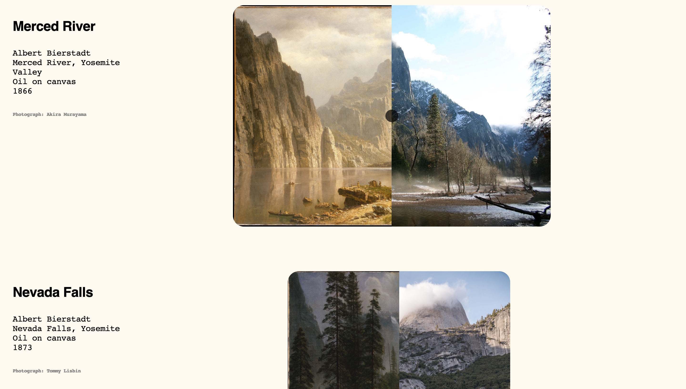
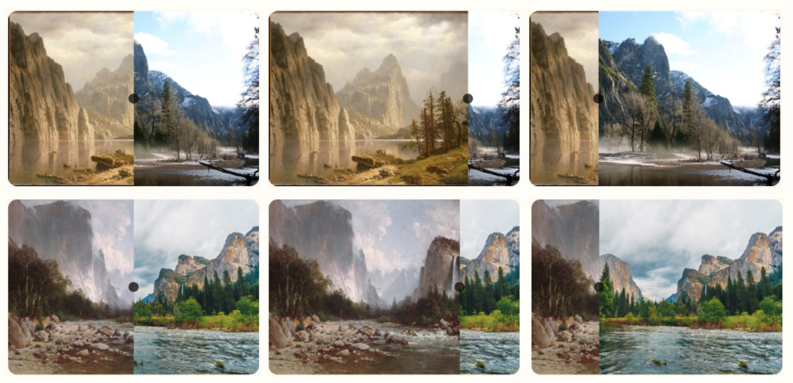
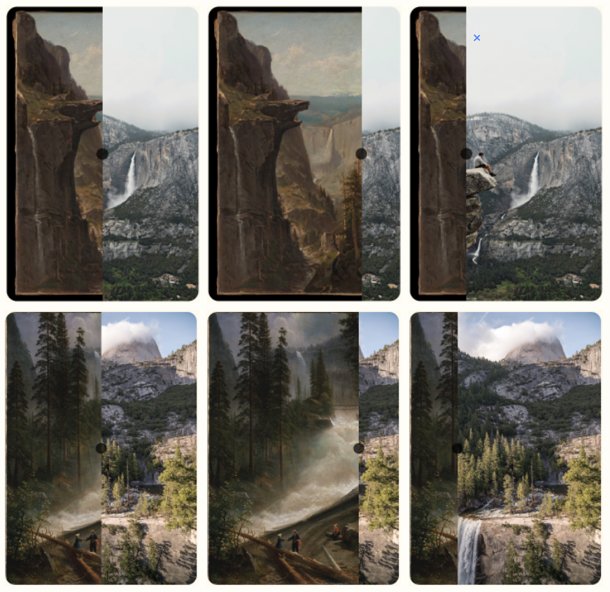
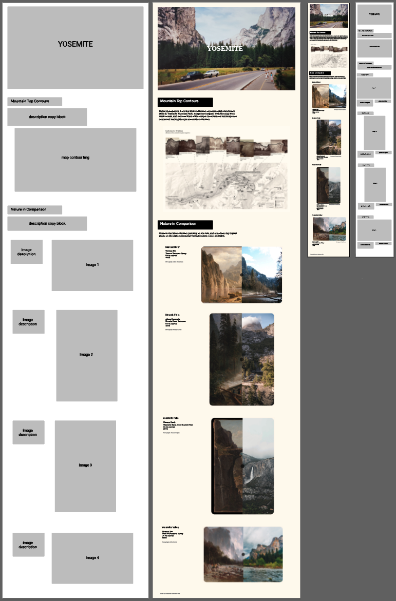

# Met Qualitative Analysis & Process
## Yosemite
October, 2019

This visualization explores Yosemite National Park through the lens of the Met.
In a qualitative analysis, I showcase both mountain contours of notable landmarks, 
as well as compare and contrast historic paintings of Yosemite with modern photographs 
of the same iconic sites. 

Visit and interact with the website:
https://amandersonyou.github.io/MajorStudio1_AAY/Met_QualViz/Yosemite/Yosemite.html

## Video of website interaction:

For the qualitative portion of the Major Studio Met project, I decided to focus 
on a specific area of landscape art I am personally connected to: Yosemite National Park.

Within the Met's collection of Yosemite related landscapes, I chose to work with
photographs and paintings. There were 4 total open access paintings with 
images available, and numerous silver negative print photographs. For my dataset,
I selected 8 photographs to represent the 8 major landmarks in the national park.

Overall, I was inspired by the nostalgia of my past camping trips, and the 
legendary design of Massimo Vignelli's national park style guide and Unigrid.

Part 1 of my visualization utilizes the photographs. Each of the photographs were 
created by the same artist. I cropped the images to remove their decorative framing, 
and drew a black contour line across the mountain tops dividing land and sky. I then 
lined up the photographs side by side based on where in the park the landmarks 
exist, from west to east, and also connecting their contour lines to lead the eye 
across all of the photographs.

Part 2 of the Yosemite exploration involves the four paintings. I was able to 
find four modern digital photographs on Unsplash that matched as 
closely as available the locations and vantage points of the historical paintings. 
The painting and photo overlap and use a JavaScript slider tool to expose each as the viewer
moves the slider back and forth. The intention is to compare multiple visual elements 
between the two such as perspective, color, light, and even the passage of time.

Each of the four painting comparisons can be interacted with to either expose more 
of the painting or more of the photograph. Below is a visual of three different views 
of each of the images.

## Layout:
I created the layout of the desktop site and of a potential mobile application using
Figma and Illustrator shown in the visual below:

Through the Yosemite artworks available at the Met, we can continue to admire and 
appreciate the magestic landscapes of the past and be inspired to preserve and 
protect them for future generations. 

