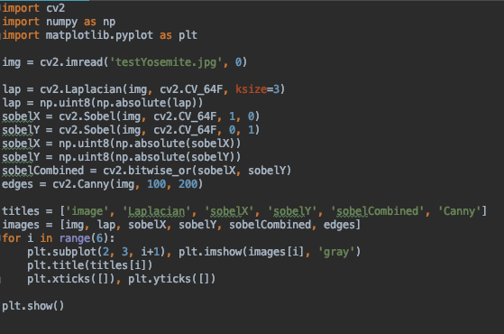
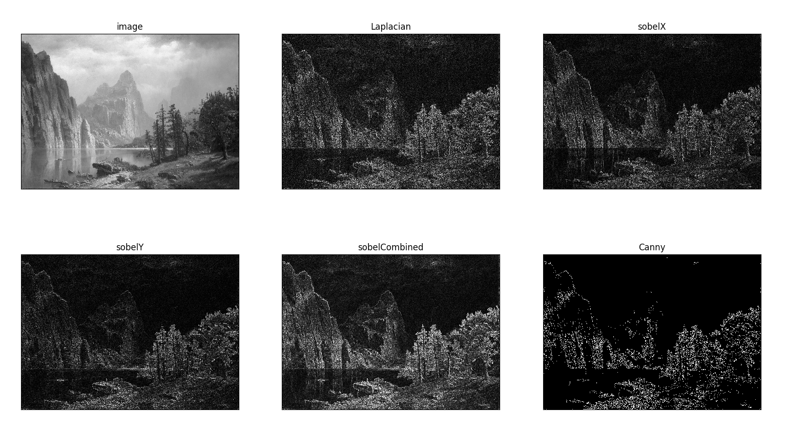

# Met Qualitative Analysis & Process

https://amandersonyou.github.io/MajorStudio1_AAY/Met_QualViz/Yosemite/Yosemite.html

For the qualitative portion of the Major Studio Met project, I decided to focus 
on a specific area of landscape art I am personally connected to: Yosemite National Park.

Within the Met's collection of Yosemite related landscapes, I decided to focus on 
photographs and paintings. There were 4 total open access paintings with 
images available, and numerous silver negative print photographs. For my dataset,
I selected 8 photographs to represent the 8 major landmarks in the national park.

Overall, I was inspired by the nostalgia of my past camping trips, the legendary 
design of Massimo Vignelli's national park style guide and Unigrid, as well as the 
font use of the Tourist Berkshires Hotel website.

Part 1 of my visualization utilizes the photographs. Each of the photographs were 
created by the same artist. I cropped the images to remove their decorative framing, 
and drew a black contour line across the mountain tops dividing land and sky. I then 
lined up the photographs side by side based on where in the park the landmarks 
exist, from west to east, and also connecting their contour lines to lead the eye 
across all of the photographs.

Originally, I looked at using OpenCV and python to create these contours. I ended up 
wanting a different aesthetic and simplified output and drew the lines by hand instead 
Which you can see in the finished visualization.

Below is a view of the OpenCV code and output:

Part 2 of the Yosemite exploration involves the four paintings. I was able to 
find four modern digital photographs on Unsplash that matched as 
closely as available the locations and vantage points of the historical paintings. 
The painting and photo overlap and use a slider tool to expose each as the viewer
moves the slider back and forth. The intention is to compare multiple visual elements 
between the two such as perspective, color, light, and even the passage of time.

Through the Yosemite artworks available at the Met, we can continue to admire and 
appreciate the magestic landscapes of the past and be inspired to preserve and 
protect them for future generations. 