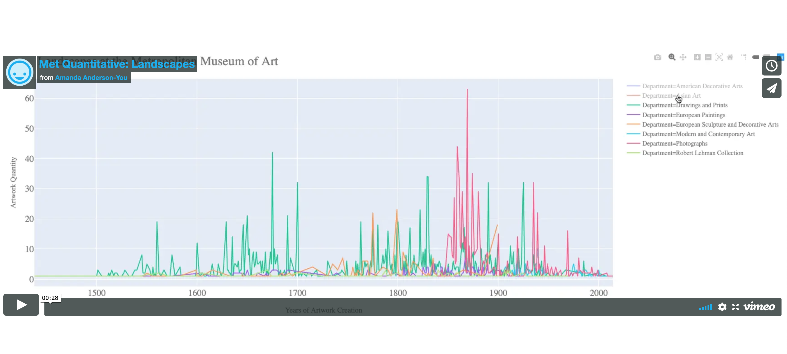
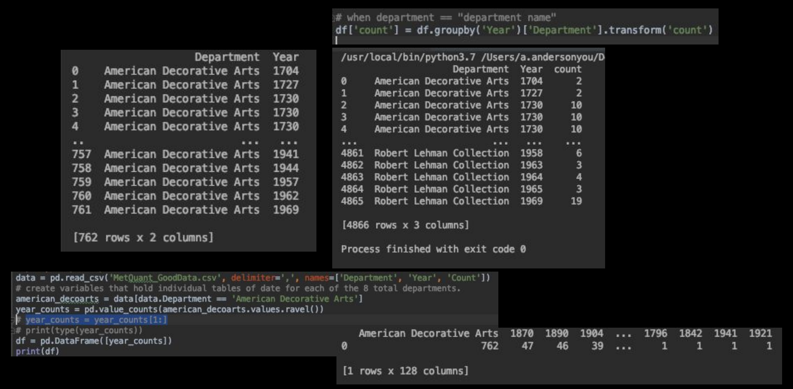
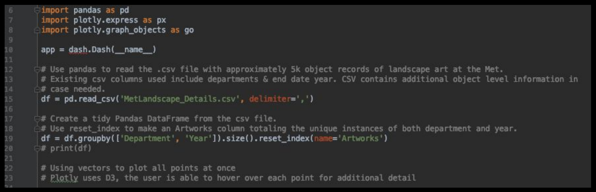
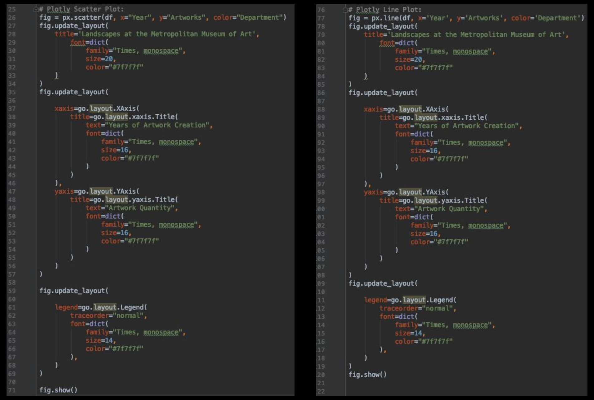

# Met Quantitative Analysis and Visualization
## Landscapes at the Met
September, 2019

This visualization examines from a high level the distribution of landscape art 
at the Metropolitan Museum of Art over time and by department.

For this project, we worked with the Met's API to make a quantitative 
analysis. We pulled data on a topic of our choice, and made a visualization.
I included objects with the keyword landscape tagged. I eliminated any departments
with fewer than 25 pieces, to ultimately assess 8 of the 16 total departments.

I used Pandas to group by year and department and create total counts. I then used 
plotly to create a line graph and a scatter plot of the data. You can explore the 
data by selected or deselecting the various deparments.

##Final visualization video: 

##Original Sketch:

##Process Documentation:

